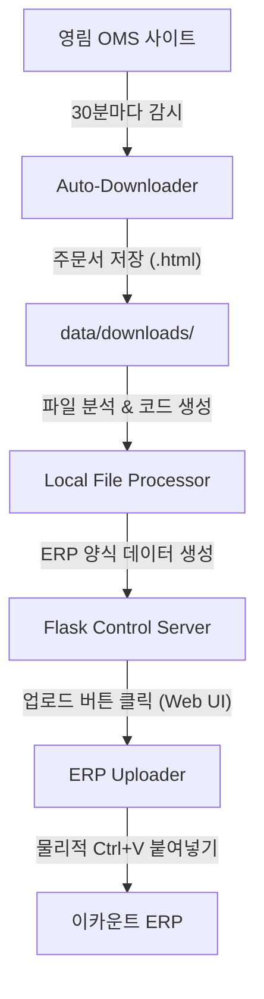

# 🎓 영림 매장 자동화 시스템 학습 가이드 (V8.1)

본 문서는 개발자가 아니어도 이 시스템이 **"왜 이렇게 설계되었는지"**와 **"어떻게 작동하는지"**를 쉽게 이해할 수 있도록 돕기 위해 작성되었습니다.

---

## 🌟 1. 시스템 개요 (Context)

매일 발생하는 수십 건의 영림 발주서를 이카운트 ERP에 수동으로 입력하는 작업은 매우 번거롭고 실수(오타)가 발생하기 쉽습니다. 본 시스템은 이 과정을 **사람이 눈으로 보고 타이핑하는 대신, AI와 정교한 스크립트가 대신 처리**하도록 설계되었습니다.

### 핵심 가치:
- **정확성**: 0.1mm의 규격 차이도 놓치지 않고 정확한 품목 코드로 변환합니다.
- **연속성**: 작업자가 자리에 없어도 30분마다 새로운 주문을 자동으로 수집합니다.
- **편의성**: 브라우저 제어판을 통해 버튼 하나로 복잡한 업로드 과정을 수행합니다.

---

## ⚙️ 2. 핵심 작동 원리 (How it works)

시스템은 크게 두 가지 바퀴로 돌아갑니다.

### 🚲 첫 번째 바퀴: Auto-Downloader (수집가)
- **감시**: 30분마다 영림 OMS 사이트에 접속합니다.
- **수집**: 새로운 '원장'이나 '견적' 내역이 있으면 HTML 파일로 내 컴퓨터에 저장합니다.
- **지능형 대기**: 만약 주문이 계속 없다면, 서버는 "아, 지금은 주문이 없는 시간이구나"라고 판단하여 확인 주기를 자동으로 늘려 시스템 리소스를 아낍니다.

### 🚲 두 번째 바퀴: ERP Uploader (배달원)
- **변환**: 수집된 HTML 파일에서 품목명, 규격, 수량을 추출합니다.
- **조합**: 과거 구글 앱스 스크립트(GAS) 시절부터 다듬어온 600줄 이상의 복잡한 로직을 통해 ERP가 인식할 수 있는 **전용 품목 코드**를 생성합니다.
- **전달**: 이카운트 ERP의 '웹자료올리기' 팝업을 열고, 데이터를 **물리적인 붙여넣기(Ctrl+V)** 방식으로 정확히 입력합니다.

---

## 🏗️ 3. 설계 철학 (Why this design?)

### 왜 중앙 설정 관리(.env)를 도입했는가?
각 컴퓨터마다 포트 번호나 대기 시간이 다를 수 있습니다. 코드 내부를 직접 수정하는 위험 대신, 설정 파일 하나만 바꿔서 **누구나 자신의 환경에 맞게 시스템을 커스터마이징**할 수 있게 하기 위함입니다.

### 왜 구조화된 로깅(JSON)을 사용하는가?
"어제 몇 건을 처리했지?", "왜 이 주문은 누락되었지?"라는 질문에 답하기 위해서입니다. 사람이 읽기 쉬운 텍스트뿐만 아니라, 나중에 통계를 내거나 AI가 분석하기 좋게 **디지털 데이터 형식(JSON)**으로 모든 발자취를 남깁니다.

---

## 📊 4. 데이터의 흐름 (Data Flow)

---

## 🏆 5. 주요 기술적 성과

1.  **MHTML 디코딩**: 글자가 깨지기 쉬운 주문서 파일을 완벽하게 복원하는 특수 디코더를 장착했습니다.
2.  **보안 브라우저 연동**: 사용자가 이미 로그인해 둔 Avast 브라우저를 그대로 빌려 써서, 별도의 보안 인증 번거로움을 없앴습니다.
3.  **실시간 대시보드**: 마치 자동차 계기판처럼, 현재 시스템이 무엇을 하고 있는지 실시간으로 보여주어 안정감을 제공합니다.

---

**작성자**: Antigravity AI  
**최종 업데이트**: 2026-01-05
