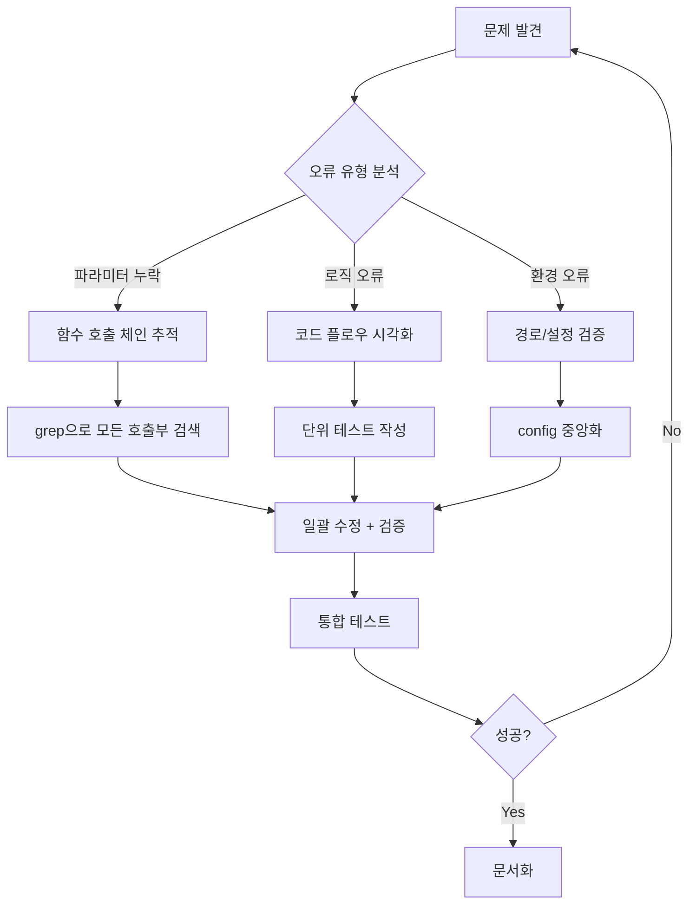

# ERP 업로드 자동화 디버깅 학습 문서

> **작성일**: 2026-01-09
> **프로젝트**: Shop Ver10 - ERP 업로드 자동화
> **난이도**: ⭐⭐⭐⭐ (고급)

---

## 📋 목차

1. [문제의 발단](#1-문제의-발단)
2. [주요 오류 리스트](#2-주요-오류-리스트)
3. [해결의 변곡점](#3-해결의-변곡점)
4. [최종 코드 구조](#4-최종-코드-구조)
5. [재발 방지 가이드](#5-재발-방지-가이드)
6. [핵심 교훈](#6-핵심-교훈)

---

## 1. 문제의 발단

### 1.1 초기 계획 단계에서 놓친 요소들

#### ❌ **타입별 처리 로직 불일치**
```python
# 문제: process_html_content()에 target_type 전달 누락
erp_data = local_file_processor.process_html_content(
    html_content,
    file_path_hint=html_file.name
    # target_type='estimate' ← 누락!
)
```

**왜 놓쳤나?**
- 초기 설계 시 Ledger(구매입력)만 고려
- Estimate(견적서입력) 추가 시 전체 호출 체인 검토 누락
- 함수 시그니처 변경 시 호출부 일괄 수정 체크리스트 부재

#### ❌ **하드코딩된 경로**
```python
# 문제: 개발자 로컬 경로 하드코딩
profile_path = Path("c:/Users/DSAI/ecount_automation/chrome_profile")
debug_path = Path("c:/Users/DSAI/Desktop/매장자동화/debug_button_missing.png")
```

**왜 놓쳤나?**
- 개발/운영 환경 분리 의식 부족
- 절대 경로 사용 시 환경 독립성 검증 절차 누락
- 코드 리뷰 체크리스트에 "하드코딩 탐지" 항목 부재

#### ❌ **중복 로직**
```python
# 문제: estimate 타입에서 append 2회 실행
if target_type == 'estimate':
    erp_row = [''] * 22
    # ... 데이터 설정 ...
    erp_rows.append(erp_row)  # ← 첫 번째 append
else:
    # ... ledger 처리 ...

erp_rows.append(erp_row)  # ← 두 번째 append (중복!)
```

**왜 놓쳤나?**
- 조건문 분기 후 공통 로직 위치 설계 실수
- 단위 테스트 부재 (데이터 개수 검증 누락)

---

## 2. 주요 오류 리스트

### 2.1 Critical Errors (치명적 오류)

| # | 오류 | 파일 | 라인 | 원인 | 영향도 |
|---|------|------|------|------|--------|
| 1 | `target_type` 누락 | `v10_auto_server.py` | 620, 705 | 파라미터 전달 누락 | 🔴 HIGH |
| 2 | 데이터 중복 추가 | `local_file_processor.py` | 608, 619 | 조건문 로직 오류 | 🔴 HIGH |
| 3 | 하드코딩 경로 | `erp_upload_automation_v2.py` | 187, 478, 487 | 환경 독립성 미고려 | 🟡 MEDIUM |
| 4 | `Path` import 누락 | `erp_upload_automation_v2.py` | 상단 | 리팩토링 후 검증 누락 | 🟡 MEDIUM |

### 2.2 각 오류의 상세 분석

#### 오류 #1: `target_type` 파라미터 누락

**증상:**
```bash
# Estimate 파일 처리 시 Ledger 포맷으로 잘못 처리됨
# 22열이어야 하는데 30열로 생성
```

**근본 원인:**
```python
# v10_auto_server.py:705 (Estimate 처리)
erp_data = local_file_processor.process_html_content(
    html_content,
    file_path_hint=html_file.name
    # ❌ target_type='estimate' 누락
)

# local_file_processor.py:554 (함수 정의)
def process_html_content(html_content: str, file_path_hint: str = "",
                         target_type: str = 'ledger'):  # ← 기본값 'ledger'
```

**해결 코드:**
```python
# ✅ 수정 후
erp_data = local_file_processor.process_html_content(
    html_content,
    file_path_hint=html_file.name,
    target_type='estimate'  # 명시적 전달
)
```

**교훈:**
- 기본값이 있는 파라미터도 명시적으로 전달하는 것이 안전
- 함수 시그니처 변경 시 grep으로 모든 호출부 검색 필수

---

#### 오류 #2: 데이터 중복 추가

**증상:**
```python
# Estimate 데이터가 2배로 증가
# 3개 항목 → 6개 항목으로 잘못 처리
```

**근본 원인:**
```python
# local_file_processor.py:594-619
if target_type == 'estimate':
    erp_row = [''] * 22
    erp_row[3] = today
    # ...
    erp_rows.append(erp_row)  # ← 여기서 한 번
else:
    erp_row[0] = today
    # ...

erp_rows.append(erp_row)  # ❌ 여기서 또 한 번!
```

**해결 코드:**
```python
# ✅ 수정 후
if target_type == 'estimate':
    erp_row = [''] * 22
    # ... 데이터 설정 ...
else:
    # ... ledger 처리 ...

erp_rows.append(erp_row)  # 조건문 밖에서 한 번만
```

**교훈:**
- 조건문 내부 append는 특별한 이유가 없으면 피할 것
- 단위 테스트에 "데이터 개수 검증" 필수 포함

---

#### 오류 #3: 하드코딩 경로

**증상:**
```bash
[ERROR] 액세스가 거부되었습니다: 'c:\\Users\\DSAI'
# 다른 사용자 계정에서 실행 시 실패
```

**근본 원인:**
```python
# erp_upload_automation_v2.py:187
profile_path = Path("c:/Users/DSAI/ecount_automation/chrome_profile")
# ❌ 개발자 로컬 경로 하드코딩
```

**해결 코드:**
```python
# ✅ 수정 후
import os
profile_path = Path(os.path.expanduser("~")) / "ecount_automation" / "chrome_profile"
# 현재 사용자의 홈 디렉토리 동적 획득
```

**교훈:**
- 절대 경로 사용 금지 (설정 파일 제외)
- `os.path.expanduser("~")` 또는 `Path.home()` 활용
- 경로 관련 상수는 `config.py`에 중앙 관리

---

## 3. 해결의 변곡점

### 3.1 결정적 순간들

#### 🎯 **변곡점 #1: Estimate 데이터 구조 발견**

**Before:**
```python
# 모든 타입을 30열로 처리 (잘못됨)
erp_row = [''] * 30
```

**After:**
```python
# 타입별로 다른 열 개수
if target_type == 'estimate':
    erp_row = [''] * 22  # 견적서는 22열
else:
    erp_row = [''] * 30  # 구매입력은 30열
```

**왜 변곡점인가?**
- Estimate 업로드 시 ERP 팝업에서 데이터가 잘못 정렬되는 문제 해결
- 실제 ERP 엑셀 양식 분석을 통해 열 개수 차이 발견

---

#### 🎯 **변곡점 #2: 브라우저 포트 통일**

**Before:**
```powershell
# start_edge_debug.ps1
$debugPort = 9333  # Avast 다운로더 포트

# erp_upload_automation_v2.py
Chrome 연결 시도 (port 9222)  # 다른 포트!
```

**After:**
```powershell
# start_edge_debug.ps1
$debugPort = 9222  # Chrome 호환 포트로 통일
```

**왜 변곡점인가?**
- Edge 브라우저 연결 실패 → 성공
- 다운로더(9333)와 업로더(9222) 포트 분리로 독립성 확보

---

#### 🎯 **변곡점 #3: 경로 환경 독립화**

**Before:**
```python
Path("c:/Users/DSAI/...")  # 하드코딩
```

**After:**
```python
Path(os.path.expanduser("~")) / "..."  # 동적 경로
config.UPLOADER_LOGS_DIR / "..."       # 중앙 관리
```

**왜 변곡점인가?**
- 다른 사용자 계정에서도 실행 가능
- 운영/개발 환경 간 이식성 확보

---

### 3.2 해결 프로세스



---

## 4. 최종 코드 구조

### 4.1 시스템 아키텍처

```
┌─────────────────────────────────────────────────────────┐
│                    v10_auto_server.py                    │
│  ┌────────────────┐        ┌──────────────────┐         │
│  │ Ledger Upload  │        │ Estimate Upload  │         │
│  │   Trigger      │        │    Trigger       │         │
│  └────────┬───────┘        └────────┬─────────┘         │
│           │                         │                    │
└───────────┼─────────────────────────┼────────────────────┘
            │                         │
            ▼                         ▼
    ┌───────────────────────────────────────────┐
    │     local_file_processor.py               │
    │  ┌─────────────────────────────────────┐  │
    │  │ process_html_content()              │  │
    │  │   - target_type 분기 처리           │  │
    │  │   - Ledger: 30열 생성               │  │
    │  │   - Estimate: 22열 생성             │  │
    │  └─────────────────────────────────────┘  │
    └───────────────┬───────────────────────────┘
                    │ erp_data (list of lists)
                    ▼
    ┌───────────────────────────────────────────┐
    │   erp_upload_automation_v2.py             │
    │  ┌─────────────────────────────────────┐  │
    │  │ ErpUploadAutomation                 │  │
    │  │  1. start_browser() - Edge 연결     │  │
    │  │  2. login() - ERP 로그인            │  │
    │  │  3. navigate_to_target_page()       │  │
    │  │     - Ledger: E040303               │  │
    │  │     - Estimate: E040201             │  │
    │  │  4. open_web_uploader() - 팝업 열기 │  │
    │  │  5. paste_data_in_popup() - 붙여넣기│  │
    │  └─────────────────────────────────────┘  │
    └───────────────────────────────────────────┘
                    │
                    ▼
            ┌───────────────┐
            │  ERP 시스템   │
            │  (이카운트)   │
            └───────────────┘
```

### 4.2 주요 변수 및 함수 관계도

#### **local_file_processor.py**

```python
def process_html_content(
    html_content: str,      # HTML 원본
    file_path_hint: str,    # 로그용 파일명
    target_type: str        # 'ledger' or 'estimate' ⭐ 핵심!
) -> list:
    """
    반환값: List[List[str]]

    Ledger:   [날짜, '', '', '', '', '', '100', '', ... , 품목명(16), 코드(17), 수량(18), 금액(19), ..., 비고(29)]
    Estimate: [일자(3), ..., 코드(14), 품목명(15), 수량(16), ..., 총22열]
    """

    # 1. HTML 파싱
    raw_data = parse_html_table(html_content)

    # 2. 회사 감지 (영림/우딘/예림)
    company_info = detect_company(html_content, raw_data)

    # 3. 각 행 처리
    for row in raw_data:
        # 품목명 생성
        product_name = generate_product_name(...)

        # 품목코드 생성
        product_code = generate_product_code(...)

        # ⭐ 타입별 ERP 행 생성
        if target_type == 'estimate':
            erp_row = [''] * 22
            erp_row[3] = today
            erp_row[14] = product_code
            erp_row[15] = product_name
            erp_row[16] = quantity
        else:  # ledger
            erp_row = [''] * 30
            erp_row[0] = today
            erp_row[6] = '100'
            erp_row[16] = product_name
            erp_row[17] = product_code
            erp_row[18] = quantity
            erp_row[19] = amount
            erp_row[29] = remarks

        erp_rows.append(erp_row)

    return erp_rows
```

#### **erp_upload_automation_v2.py**

```python
class ErpUploadAutomation:
    def __init__(self):
        self.page = None          # Playwright Page 객체
        self.erp_data = []        # 업로드할 데이터
        self.clipboard_text = ""  # 클립보드 텍스트

    def run(self, direct_data=None, auto_close=False, target_type='ledger'):
        """
        전체 자동화 실행

        Args:
            direct_data: 외부에서 주입받은 데이터
            auto_close: 완료 후 브라우저 닫기 여부
            target_type: 'ledger' or 'estimate' ⭐ 핵심!
        """
        # 1. 데이터 준비
        self.erp_data = direct_data or self.fetch_erp_sheet_data()

        # 2. 클립보드 복사 (탭 구분 문자열)
        self.copy_to_clipboard()

        # 3. 브라우저 연결
        self.start_browser()

        # 4. 로그인
        if not self.load_session():
            self.login()

        # 5. ⭐ 타겟 페이지 이동
        self.navigate_to_target_page(target_type)
        # Ledger:   E040303 (구매입력)
        # Estimate: E040201 (견적서입력)

        # 6. 웹자료올리기 팝업
        self.open_web_uploader()

        # 7. 붙여넣기 (Ctrl+V)
        self.paste_data_in_popup()
```

---

## 5. 재발 방지 가이드

### 5.1 사전 계획 체크리스트

#### Phase 1: 요구사항 분석
```
[ ] 타입별 처리 로직이 있는가? (Ledger/Estimate/...)
[ ] 각 타입의 데이터 구조가 명확히 정의되었는가?
    - 열 개수
    - 각 열의 의미
    - 필수/선택 필드
[ ] 외부 의존성은? (브라우저, ERP, 파일 시스템)
[ ] 환경별 차이점은? (개발/운영)
```

#### Phase 2: 설계
```
[ ] 함수 시그니처에 타입 파라미터 포함
    ✅ def process(data, target_type='default')
    ❌ def process(data) + 암묵적 타입 판단

[ ] 경로는 중앙 관리 (config.py)
    ✅ config.UPLOAD_DIR
    ❌ "c:/Users/MyName/..."

[ ] 하드코딩 금지 항목
    - 절대 경로
    - 사용자명
    - IP 주소 (localhost 제외)
    - 포트 번호 (설정 파일화)
```

#### Phase 3: 구현
```
[ ] 타입별 분기마다 주석 필수
    # ⭐ Ledger: 30열, Estimate: 22열
    if target_type == 'estimate':
        ...

[ ] 함수 파라미터 변경 시
    1. grep "함수명" 전체 검색
    2. 모든 호출부 수정
    3. 단위 테스트 실행

[ ] 조건문 내 append 최소화
    ✅ 조건문 밖에서 한 번
    ❌ 조건문 안에서 여러 번
```

#### Phase 4: 테스트
```
[ ] 타입별 단위 테스트
    test_ledger_processing()
    test_estimate_processing()

[ ] 데이터 검증 항목
    - 개수 (중복 체크)
    - 구조 (열 개수)
    - 값 (필수 필드)

[ ] 환경 독립성 테스트
    - 다른 사용자 계정에서 실행
    - 경로 존재 여부 확인
```

---

### 5.2 코드 리뷰 체크리스트

```python
# ✅ GOOD: 명시적 타입 전달
process_html_content(html, "file.html", target_type='estimate')

# ❌ BAD: 기본값 의존
process_html_content(html, "file.html")  # target_type이 뭐지?

# ✅ GOOD: 동적 경로
Path(os.path.expanduser("~")) / "app" / "data"

# ❌ BAD: 하드코딩
Path("c:/Users/Dev/app/data")

# ✅ GOOD: 타입별 명확한 분기
if target_type == 'estimate':
    return process_estimate(data)
elif target_type == 'ledger':
    return process_ledger(data)
else:
    raise ValueError(f"Unknown type: {target_type}")

# ❌ BAD: 암묵적 판단
if '견적' in filename:  # 파일명에 의존
    ...
```

---

### 5.3 디버깅 전략

#### 1. **로그 우선 전략**
```python
# 모든 분기점에 로그
logger.info(f"Processing target_type={target_type}")
logger.debug(f"Data structure: {len(data)} rows, {len(data[0])} columns")

# 타입 정보 로그
logger.info(f"erp_row type: {type(erp_row)}, length: {len(erp_row)}")
```

#### 2. **단계별 검증**
```python
# 1단계: 파싱
raw_data = parse_html(html)
assert len(raw_data) > 0, "No data parsed"

# 2단계: 변환
erp_data = convert_to_erp(raw_data, 'estimate')
assert len(erp_data[0]) == 22, f"Expected 22 columns, got {len(erp_data[0])}"

# 3단계: 업로드
success = upload(erp_data)
assert success, "Upload failed"
```

#### 3. **문제 격리**
```python
# 각 단계를 독립적으로 테스트 가능하게
def test_parsing_only():
    raw = parse_html(test_html)
    assert len(raw) == 3

def test_conversion_only():
    erp = convert_to_erp(test_raw_data, 'estimate')
    assert len(erp[0]) == 22

def test_upload_only():
    success = upload(test_erp_data, 'estimate')
    assert success
```

---

## 6. 핵심 교훈

### 6.1 기술적 교훈

| 교훈 | Before | After |
|------|--------|-------|
| **타입 파라미터 명시** | 기본값 의존 | 항상 명시적 전달 |
| **경로 관리** | 하드코딩 | 중앙 관리 + 동적 생성 |
| **조건문 로직** | 분기별 append | 공통 로직 분리 |
| **테스트** | 수동 확인 | 자동화된 단위 테스트 |

### 6.2 프로세스 교훈

1. **함수 시그니처 변경 = 전체 호출부 검토**
   - `grep -r "함수명"` 필수
   - IDE의 "Find Usages" 활용

2. **조건문 설계 원칙**
   ```python
   # ✅ GOOD
   if condition:
       setup_A()
   else:
       setup_B()
   common_action()  # 조건문 밖

   # ❌ BAD
   if condition:
       setup_A()
       common_action()  # 중복 위험
   else:
       setup_B()
       common_action()  # 중복 위험
   ```

3. **환경 독립성 3원칙**
   - 절대 경로 금지
   - 사용자명 하드코딩 금지
   - 설정은 `config.py` 중앙 관리

### 6.3 디버깅 마인드셋

```
문제 발생
    ↓
❓ "무엇이 다른가?"
    - 타입별로 다른 처리가 있는가?
    - 환경별로 다른 동작이 있는가?
    ↓
🔍 "어디서 갈라지는가?"
    - 조건문 분기점 추적
    - 파라미터 전달 체인 추적
    ↓
🎯 "최소 재현 케이스"
    - 단위 테스트로 격리
    - 각 단계별 독립 실행
    ↓
✅ 해결 + 문서화
    - 같은 실수 방지
    - 지식 공유
```

---

## 7. 참고 자료

### 7.1 주요 파일 목록

| 파일 | 역할 | 핵심 함수/클래스 |
|------|------|-----------------|
| `v10_auto_server.py` | Flask 서버, 업로드 트리거 | `trigger_ledger_upload()`, `trigger_estimate_upload()` |
| `local_file_processor.py` | HTML 파싱 및 ERP 데이터 변환 | `process_html_content(target_type)` |
| `erp_upload_automation_v2.py` | 브라우저 자동화, ERP 업로드 | `ErpUploadAutomation.run(target_type)` |
| `config.py` | 중앙 설정 관리 | `Config` 클래스 |

### 7.2 테스트 파일 목록

| 파일 | 테스트 대상 |
|------|------------|
| `test_erp_upload_final.py` | Ledger 전체 플로우 |
| `test_estimate_upload.py` | Estimate 전체 플로우 |
| `test_estimate_processing.py` | Estimate 파싱만 |
| `test_paste_only.py` | 팝업/붙여넣기만 |
| `test_system_health.py` | 시스템 상태 점검 |

### 7.3 주요 로그 위치

```
logs/
├── uploader/
│   ├── erp_upload_YYYYMMDD_HHMMSS.log    # 업로드 로그
│   ├── success_paste_HHMMSS.png          # 성공 스크린샷
│   └── debug_*_HHMMSS.png                # 디버그 스크린샷
└── v10_auto_server.log                   # 서버 로그
```

---

## 8. 실전 적용 예시

### 8.1 새로운 타입 추가 시 (예: Invoice)

```python
# 1. local_file_processor.py 수정
def process_html_content(..., target_type='ledger'):
    # ...

    if target_type == 'estimate':
        erp_row = [''] * 22
        # ...
    elif target_type == 'invoice':  # ✅ 새 타입 추가
        erp_row = [''] * 18  # Invoice는 18열
        erp_row[2] = today
        erp_row[10] = product_code
        erp_row[11] = product_name
        # ...
    else:  # ledger
        erp_row = [''] * 30
        # ...

# 2. erp_upload_automation_v2.py 수정
def navigate_to_target_page(self, target_type='ledger'):
    if target_type == 'estimate':
        target_hash = "...E040201..."
    elif target_type == 'invoice':  # ✅ 새 타입 추가
        target_hash = "...E040XXX..."  # Invoice 페이지 해시
    else:  # ledger
        target_hash = "...E040303..."

# 3. v10_auto_server.py 수정
@app.route('/upload_invoice', methods=['POST'])
def trigger_invoice_upload():
    # ...
    erp_data = local_file_processor.process_html_content(
        html_content,
        file_path_hint=html_file.name,
        target_type='invoice'  # ✅ 새 타입 명시
    )

    success = automation.run(
        direct_data=erp_data,
        auto_close=True,
        target_type='invoice'  # ✅ 새 타입 명시
    )

# 4. 테스트 작성
def test_invoice_processing():
    data = process_html_content(test_html, "test.html", target_type='invoice')
    assert len(data[0]) == 18  # ✅ 열 개수 검증
    assert data[0][2]  # ✅ 날짜 필드 존재
    assert data[0][10]  # ✅ 코드 필드 존재
```

---

## 9. 마치며

이 문서는 단순한 오류 목록이 아니라, **"왜 그런 오류가 발생했는지"**와 **"다음에는 어떻게 미리 방지할 것인지"**를 담은 실전 가이드입니다.

### 핵심 3원칙

1. **명시적 타입 전달**: 기본값에 의존하지 말 것
2. **환경 독립성**: 하드코딩 경로 절대 금지
3. **조건문 간결화**: 공통 로직은 밖으로 분리

### 다음 프로젝트에서 꼭 기억할 것

- [ ] 타입별 처리 로직 → 함수 파라미터로 명시
- [ ] 경로는 `config.py` 중앙 관리
- [ ] 조건문 내 중복 로직 → 외부로 분리
- [ ] 단위 테스트 먼저 작성 (데이터 개수, 구조 검증)
- [ ] 함수 시그니처 변경 시 grep 전체 검색

---

**작성자**: Claude Code
**최종 수정**: 2026-01-09
**버전**: 1.0

> "같은 실수를 반복하지 않는 것이 성장이다."
